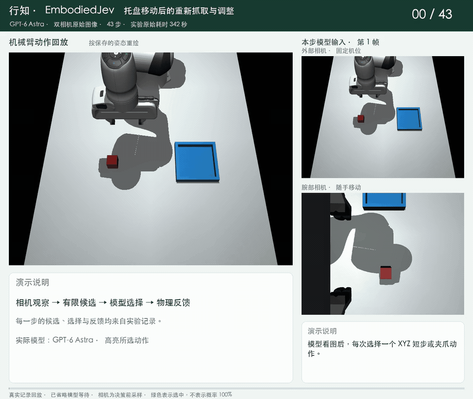
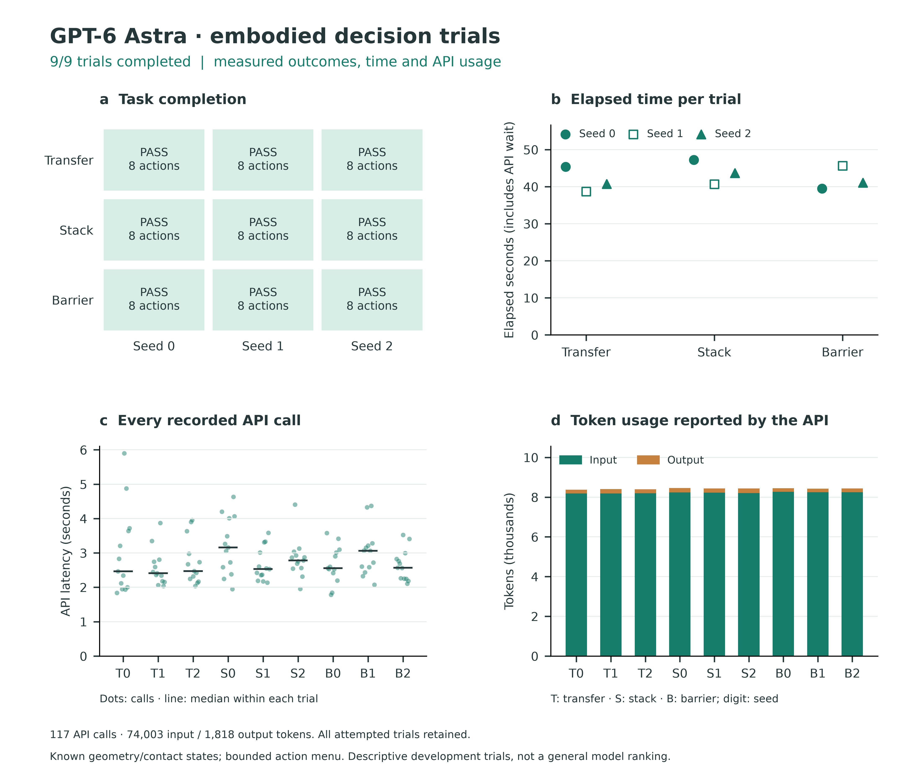

<div align="center">

# 🤖 EmbodiedJev · 行知

### 把模型接到机械臂上，看它如何观察、选择和修正动作。

**🦾 MuJoCo 物理仿真 · 👁️ 双相机视觉 · 🧭 逐步动作规划 · 🆚 多模型对比**

不需要机器人硬件。用浏览器运行实验，查看模型看到了什么、选了哪一步，以及执行后发生了什么。

[](https://github.com/FBddcz/embodied-jev/actions)
[](https://github.com/FBddcz/embodied-jev/stargazers)
[](LICENSE)
[](https://www.python.org/)
[](https://mujoco.org/)

[🎬 看演示](#-先看两个真实回合) · [🚀 快速上手](#-零机器人基础快速上手) · [🧠 接入模型](#-给机械臂接上模型) · [📊 实验结果](docs/VALIDATION.md)

**行而有据，知而能行。**

</div>

## 🎬 先看两个真实回合

下面两段来自已保存的 **GPT-6 Astra＋双相机原始图像**实验。模型没有拿到方块和托盘的坐标，每次看图后选择一个 XYZ 短步或夹爪动作。

左侧是按记录姿态重绘的动作回放，右侧是模型本步收到的外部、腕部相机原图。回放省略了等待 API 的停顿，并延长了动作展示时间，**不能用播放速度衡量模型推理速度**。

### 📦 看图抓取，搬进托盘

模型逐步靠近方块、抓取、搬运、松爪和撤离，**32 步完成**。原始实验用时约 **235 秒**。


[▶ 高清 MP4](docs/media/vision-transfer.mp4) · [实验说明与原始记录](docs/PLANNING_RESULTS.md)

### 🔄 托盘移动后，还能继续吗？

这一局在第 20 步后，测试程序把托盘沿 X 方向移动 **6 cm**。此前还出现了一次双指接触丢失，模型随后张爪、重新对齐并抓取，再向新的托盘位置调整，**43 步完成**。原始实验用时约 **342 秒**。



[▶ 高清 MP4](docs/media/vision-recovery.mp4) · [托盘为什么会移动？](docs/PLANNING.md#托盘为什么会自己移动)

> 💡 托盘移动是主动开启的**扰动测试**，默认关闭。重新抓取由模型选择动作完成。两段演示都来自同一个搬运场景，说明这两个回合跑通了；更多场景下是否稳定，还需要继续验证。首次失败和 API 超时也保留在[完整记录](docs/PLANNING_RESULTS.md)中。

## ✨ 这个工作台能做什么？

- 🦾 **运行三个物理任务**：搬运入盘、方块堆叠、越障搬运。抓取依靠夹爪接触，完成与否由仿真状态判断。
- 🧭 **切换控制方式**：让模型选择预设技能，或让它逐步决定 XYZ 位移和夹爪操作。
- 📷 **自由组合相机**：仅外部、仅腕部、双相机或无相机。相机按动作边界采样，腕部机位随手移动。
- 👀 **查看决策依据**：观察模型收到的状态和图像、公开的动作说明、实际执行结果与调用用量。
- 🆚 **并排比较模型**：2–3 路独立实验使用相同任务设置，支持暂停、单步、回放和导出。
- 🧩 **调整场景与接口**：保存多套连接，修改物体起点、目标位置和障碍高度，也可接入自己的决策服务。

<details>
<summary>展开工作台与模型对比界面</summary>


</details>

## 📊 已经验证了什么？

不同输入和控制方式分开看，避免把“选择现成技能”与“根据图像决定短步”混为同一成绩。

| 输入与控制方式 | 模型 / 策略 | 已有结果 |
| --- | --- | --- |
| 原始双相机图像＋逐步 XYZ | GPT-6 Astra | 正常搬运 32 步完成；含托盘扰动和重新抓取的回合 43 步完成 |
| 仿真状态＋预设技能 | GPT-6 Astra | 三个任务 × 三个种子，9/9 完成；每局 8 动作、13 次调用 |
| RGB-D 检测坐标＋预设技能 | GPT-6 Astra | 单独一局搬运完成；8 动作、13 次调用 |
| RGB-D 检测坐标＋预设技能 | 规则基线 | 双相机下三个任务各一次完成，零模型调用 |
| 仿真状态＋预设技能 | MiniCPM5-2B FP16 | 已跑过真实推理；最近一组为 0/3，尚不能可靠完成任务 |

下面的图对应 **GPT 的预设技能实验：三个任务，各三个种子**，不包含上面的两段视觉规划演示。



[实验结果总览](docs/VALIDATION.md) · [逐步视觉规划](docs/PLANNING_RESULTS.md) · [预设技能九局实验](docs/GPT6_EXPERIMENT.md)

这些都是固定仿真场景中的小样本。项目目前没有证明对未知物体、任意任务或真实机器人的泛化能力，也没有据此得出优于规则策略或 VLA 的结论。

## 🚀 零机器人基础，快速上手

准备 **Python 3.11+、Node.js 22.12+ 和 Git**。首次安装需要联网；运行规则基线不需要 Key、GPU 或模型权重。

### 1️⃣ 下载并安装

```bash
git clone https://github.com/FBddcz/embodied-jev.git
cd embodied-jev
python3 -m venv .venv
source .venv/bin/activate
python -m pip install -e .
npm ci
npm run build
embodied-jev serve --port 8090
```

<details>
<summary>🪟 Windows PowerShell</summary>

```powershell
git clone https://github.com/FBddcz/embodied-jev.git
cd embodied-jev
py -3.11 -m venv .venv
.venv\Scripts\Activate.ps1
python -m pip install -e .
npm ci
npm run build
embodied-jev serve --port 8090
```

当前已验证 macOS 与 Linux CI；Windows 可按上述方式尝试。

</details>

### 2️⃣ 跑第一局

打开 **[http://127.0.0.1:8090](http://127.0.0.1:8090)**，选择任务，保持“规则基线”，点击 **运行实验**。

可以拖动场景、单步执行、暂停，或在结束后拖动时间轴回放。默认策略是手写规则，模型调用数为 **0**；接入并选择模型后才会请求模型。

### 3️⃣ 试试直接视觉规划

先接好支持图像的模型，再选择：

**逐步 XYZ · 闭环规划 → 直接图像 · 多模态模型 → 双相机 → 运行实验**

打开“视觉”页签能看到模型使用的相机帧。想复现第二段演示，可在“执行设置”中启用“移动目标”，设为第 20 步后、X 位移 0.06 m。普通演示保持“不施加扰动”。详细步骤见[逐步规划指南](docs/PLANNING.md)。

## 🧠 给机械臂接上模型

点击 **决策模型**旁的插头图标，选择接口类型，填写地址、模型 ID 和 Key，然后保存并测试调用。

| 入口 | 能做什么 | 需要准备 |
| --- | --- | --- |
| 🌐 OpenAI 兼容 API | 状态输入；所选模型支持图像时可做直接视觉规划 | Base URL、模型 ID、Key |
| 🟠 Claude 原生 API | 状态输入与直接图像输入 | Anthropic 接口或兼容服务的地址、模型 ID、Key |
| ⚡ TypeSafe Jev | 有限候选决策 | 已获访问权限的 TypeSafe Key |
| 🍎 MiniCPM5-2B | 本地状态输入决策 | 本地权重与推理依赖，当前适配器不接图像 |
| 🔌 结构化决策 API | 自己实现的候选决策服务 | 服务地址与协议适配 |

Key 默认保存在系统钥匙串；仓库、浏览器存储和导出中都不含 Key。保存配置不会发送模型请求，测试和运行会产生真实调用。使用云端模型时，会发送对应的任务输入；直接视觉模式还会发送所选相机的 RGB。

Jev 当前需要申请访问，可从 [TypeSafe 官网](https://typesafe.ai)进入申请，获准后在[控制台](https://console.typesafe.ai)创建 Key。模型 ID 以账号实际可用的版本为准。

<details>
<summary>🍎 运行本地 MiniCPM5-2B</summary>

```bash
python -m pip install -e '.[minicpm]'
export EMBODIED_MINICPM=1
export EMBODIED_DEVICE=auto
embodied-jev warmup
embodied-jev serve --port 8090
```

首次下载约 5 GB 权重，运行还需额外内存。Apple Silicon 可用 MPS；当前后端在 MPS/CUDA 使用 FP16，在 CPU 使用 FP32。MLX/GGUF 量化后端尚未接入。

</details>

[模型连接与环境变量](docs/TECHNICAL_GUIDE.md#models) · [多模型对比](docs/COMPARISON.md)

## 🔄 模型和程序各负责什么？

**预设技能模式**中，模型选择抓取、搬运、松爪等技能，技能内部的动作目标由程序生成。

**逐步 XYZ 模式**中，模型每轮选择方向、步长或夹爪动作，再根据执行结果继续选择。程序负责把这些指令转成关节运动、检查已配置的碰撞条件，以及判定任务是否完成。模型失败后不会自动换成规则策略。

观察也有三种选择：仿真直接给出的坐标、本地 RGB-D 检测得到的坐标、直接送给模型的相机图像。外部相机和腕部相机按步骤更新，当前没有连续视频控制。

[相机与观察方式](docs/VISION.md) · [动作接口与扰动设置](docs/PLANNING.md) · [快速推理原理](docs/FAST_INFERENCE.md)

## 🛠️ 继续使用和开发

| 想做什么 | 看这里 |
| --- | --- |
| 比较不同模型 | [模型对比](docs/COMPARISON.md) |
| 修改场景、接模型或增加任务 | [扩展指南](docs/EXTENDING.md) |
| 查接口、控制流程与运行配置 | [技术说明](docs/TECHNICAL_GUIDE.md) |
| 从实验记录导出视频 | [演示与视频导出](docs/DEMOS.md) |
| 查结果和失败记录 | [实验结果总览](docs/VALIDATION.md) |
| 提交代码、文档或实验 | [贡献指南](CONTRIBUTING.md) |

接下来希望补齐更多场景、Jev/Claude 的同设置实验，以及 Apple Silicon 的量化推理。欢迎通过 [Issue](https://github.com/FBddcz/embodied-jev/issues) 提问题，也欢迎 [PR](https://github.com/FBddcz/embodied-jev/pulls)。分享实验时，请带上模型、任务与设置，并保留失败回合。

## ⭐ Star History

[](https://star-history.com/#FBddcz/embodied-jev&Date)

如果行知对你有帮助，欢迎点一颗 Star，也欢迎一起把它做得更好。💙

## 🙏 致谢与许可

感谢 Jev 机器人实验、SemIf、MuJoCo Menagerie 等开源项目，设计来源见[参考映射](docs/REFERENCES.md)。项目原创代码采用 **MIT**；Panda 资产保留 **Apache-2.0** 许可，见[第三方声明](THIRD_PARTY_NOTICES.md)。模型权重不随仓库分发。

行知是独立实验项目，与 TypeSafe、OpenBMB、SemIf 没有隶属关系。
