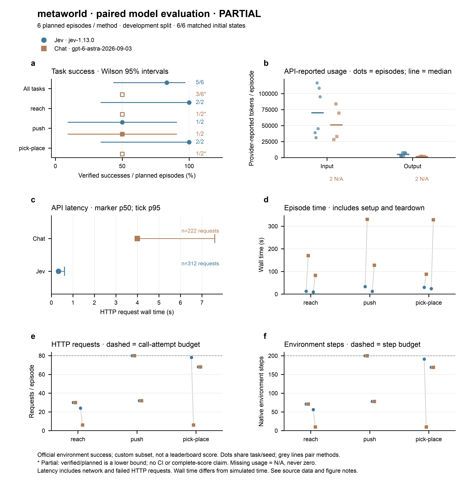
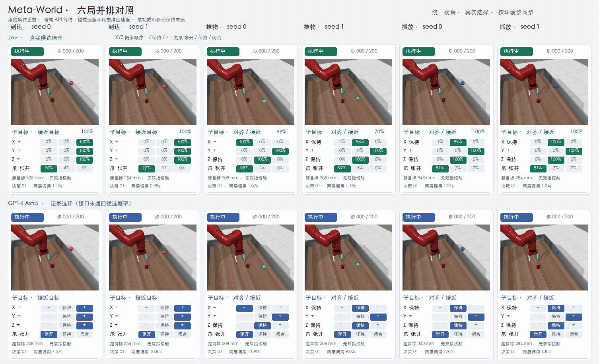

# Meta-World 实测结果

日期：2026-09-21。任务为 reach、push、pick-place，各使用 seed 0、1。环境为 Meta-World 3.1.1 / MuJoCo 3.3.0；每局最多 200 步、40 个规划周期、80 次请求、600 秒。

## 直接控制

| 指标 | Jev | GPT-6 Astra |
| --- | ---: | ---: |
| 成功 | 2/6 | 5/6 |
| 到达 / 推物 / 抓放 | 2/2 · 0/2 · 0/2 | 2/2 · 1/2 · 2/2 |
| 请求数 | 187 | 118 |
| API 报告输入 / 输出用量 | 275,616 / 26,928 | 105,361 / 11,412 |

[图表与逐局数据](results/metaworld-direct-2026-09-21/)。

## 层级 v2

v2 先选子目标，再选 XYZ／夹爪方向。Jev 六局完整；GPT-6 六局均已尝试，其中两局请求超时，所以 GPT 只列已观察结果，不给出完整成功率。

| 指标 | Jev | GPT-6 Astra |
| --- | ---: | ---: |
| 成功 / 计划 | 5/6 | 3/6（另 2 局超时） |
| 到达 / 推物 / 抓放 | 2/2 · 1/2 · 2/2 | 1/2 · 1/2 · 1/2 |
| 环境步数 | 765 | 538 |
| 请求数 | 312 | 222 |
| API 报告输入用量 | 435,903 | 222,891（220/222 次） |
| API 报告输出用量 | 30,620 | 6,291（220/222 次） |
| HTTP 延迟 p50 / p95（秒） | 0.328 / 0.611 | 3.997 / 7.594 |
| 每局耗时中位数（秒） | 18.389 | 149.021 |

上排 Jev、下排 GPT-6；列为到达、推物、抓放的 seed 0 / 1。按环境步同步回放，展示子目标、四通道选择与调用耗时；Jev 显示真实概率，GPT 无概率。超时局停在最后记录位置。回放省略 API 等待，不代表推理速度。[MP4](results/metaworld-hierarchy-v2-2026-09-21/figures/hierarchy-grid.mp4)

[图表与逐局数据](results/metaworld-hierarchy-v2-2026-09-21/)。完整逐请求记录保存在实验工作目录的主批次报告中。

## 失败重点

- 两模型的 `push-v3-0` 都在通信正常时耗尽 200 步。物体确实被推动，但接触保持和重新对齐失败；Jev 最近目标距离 126.4 mm、最终 279.9 mm，GPT-6 分别为 129.7 mm、365.3 mm。
- GPT-6 的 `reach-v3-1`、`pick-place-v3-0` 在第 6 次请求超时，各执行 10 步。超时不能区分本地网络、网关或上游服务，也不能据此判定规划失败。
- v2 同时改了状态表达、子目标提示和控制阶段，因此不是纯“子目标层”单因素消融。直接控制的 2/6 与 5/6 仅作为历史参考，预算也不同。

## Token 口径

表中的 token 是服务商响应里的 `usage` 用量字段（[Jev API](https://docs.typesafe.ai/api) 将其定义为该请求的 token usage）。Jev 返回结构化选项而不是自由文本聊天，但 Jev API 仍返回 `input_tokens` / `output_tokens`，程序按原字段记录；这不等于 Jev 生成了与 GPT 聊天输出同类的文本，两家用量也不能直接换算成本。缺失用量保留为未知，不补零。

抓放的官方成功判定是物体到目标不超过 7 cm，不要求松手和撤离；本结果不代表完整放置流程。规则参考控制 5/6 仅用于验证物理链路，不计入模型成绩。
