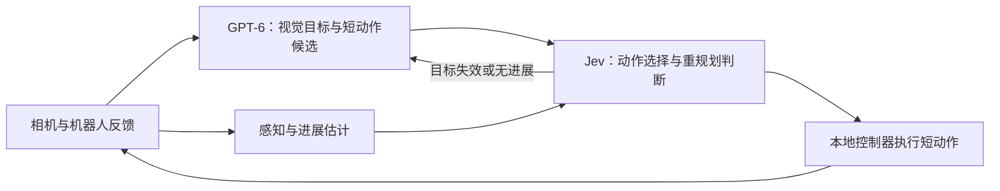

# Jev 应该接在哪一层

**建议：GPT-6 负责看图、理解任务和提出短动作候选；Jev 负责选择候选、判断是否继续与何时重规划；本地控制器负责连续执行。** Jev 的价值应在依赖任务语义的判断上，数值误差、坐标变换和关节伺服交给代码。

2026-09-22 核对 TypeSafe 官方文档，并搜索、筛读 GitHub 的 Jev 机器人项目；以下区分源码实现、作者报告与本项目实测。没有在本地复现这些上游项目的成绩。

## 为什么当前接法需要调整

当前 LIBERO 混合组里，GPT-6 从双相机画面给出航点，Jev 接收航点误差，再分别选择 XYZ、旋转与夹爪方向。它不接收图片，也没有实际接触力输入。

微波炉失败局中，**1344 次运动轴选择都符合给定航点的误差规则**；但 **174/224 次动作**里，末端移动超过 5 mm，门开度变化不到 0.05°。门最接近关闭时仍有 55.78°，最终 61.11°。这说明当前主要缺口是**有效接触和物体进展反馈**。选择正确的轴方向，无法修复不合适的航点。

官方明确写明：Jev 1.13 只接收文本，擅长有限、明确的判断；精确算术应放在代码里，数值 Score 不适合直接插值得到精确控制量。[输入能力](https://docs.typesafe.ai/models) · [已知限制](https://docs.typesafe.ai/model-jaggedness/jev-1.13) · [构建方法](https://docs.typesafe.ai/concepts/how-to-build-with-system-one)

## 开源项目里值得借鉴的部分

| 项目／核对版本 | 实际接法 | 对本项目的启发与边界 |
| --- | --- | --- |
| [jev-libero · 3bdad98](https://github.com/Dimweaker/jev-libero/tree/3bdad985b225aeccc39fbe5863c6eea2e81c515a) | 程序预演候选，Jev 依次选意图、接触／运动类别、原子动作；有两步预演 | 借鉴“按预期效果选动作”。**它使用仿真关节真值、接触、预测成功等信息**，不是纯相机控制；不能直接与本项目视觉组比费用／成功率 |
| [robojev · 76ebe5c](https://github.com/alee792/robojev/tree/76ebe5c964fef105e3f2e44e0c5315f1519b5e78) | WidowX 真机实验；Jev 选目标、放置关系、动作基元；事件触发调用，丢弃过期响应 | 对 Piper 最有借鉴价值的是执行循环与推理分离。作者坦承对一个纸杯和桌面高度拟合；场景相机、VLM 命名层等未在真机闭环验证 |
| [UR5e + Jev · ffffb2e](https://github.com/JoeSun-421/robotic_agent_use_jev/tree/ffffb2e27edd4717970e5c03fbbbb2a90a979a33) | Qwen 视觉分类，Jev 选目标、双臂调度、运动类别和恢复策略；代码执行 IK | 借鉴双臂分工和技能选择。但执行端仍绑定仿真物体／箱体坐标，不等于全链路只靠真实视觉；公开演示仍待补齐 |
| [OpenRoboto · 7a4ed8b](https://github.com/openroboto-ai/jev-robot-control/tree/7a4ed8b72c3c17d7aa790678ed9660df67c10dd3) | 意图 → XYZ／夹爪选择；结构化几何和接触输入 | 与现有 Meta-World 分层接法接近；公开对比每模型仅一局、非相机感知，不能据此证明通用机器人能力 |
| [Jev-as-Policy · cac97e7](https://github.com/YuanKJing/Jev-as-Policy/tree/cac97e79845bf56a5b2ef0e6d4928238bf5caee7) | 意图 → XYZ／夹爪选择；连续 Cartesian servo；API 等待期间继续执行；抓取／下放阶段降速；新观测重新计算目标 | 结构最接近当前控制器，但仓库明确是 **MuJoCo 仿真、无硬件驱动**；几何、接触和抓取状态来自仿真真值，不能当相机 VLA 结果 |
| [RoboJEV · 30f0aae](https://github.com/lykycy123/RoboJEV/tree/30f0aae82db1d96e4977a95321990238597c83e0) | 结构化状态与分层选择；独立规则基线、多种子 | 借鉴评价方法。新挑战集跨障碍抓放为 Jev 5/10、规则 8/10，提醒我们必须实测 Jev 相比规则是否有额外收益 |
| [jev-realtime-sdk · 61ad2bf](https://github.com/chy4pro/jev-realtime-sdk/tree/61ad2bf5f37e0159185d9430b3d127a70b507fc8) | 代码执行快循环，Jev 执行慢决策循环；动作有效期、过期响应处理 | 借鉴软件接口。该版本只验证模拟执行器，尚无真实执行器部署，不能当作真机成熟度证据 |
| [Piper Astra + Jev · 10d671e](https://github.com/RobotKitAI/piper-astra-jev/tree/10d671e01d467475084033e7af9f6595886ab7b3) | 真实 AgileX Piper；Astra 直接看图；Jev 配合 Grounding DINO／SAM3；夹爪状态确认后才允许抬升；深度失效时用物体几何 | 最贴近后续 Piper 试验的公开参考。8 个单次演示不是成功率基准；代码、硬件和相机标定仍需逐项复核 |

**jev-libero 跑得好，包含候选生成、物理预演和任务条件的贡献。** 它的 `microwave.json` 直接向选择器提供预测关门角度、目标接触、障碍力和是否完成；Jev 从已有这些证据的候选里选择。物理预测来自 MuJoCo，不是 Jev 自己预测未来画面。[任务配置源码](https://github.com/Dimweaker/jev-libero/blob/3bdad985b225aeccc39fbe5863c6eea2e81c515a/src/jev_libero/tasks/microwave.json) · [分层选择](https://github.com/Dimweaker/jev-libero/blob/3bdad985b225aeccc39fbe5863c6eea2e81c515a/src/jev_libero/policy.py)

### Jev-as-Policy 具体能借什么

它的代码把已知几何计算留在本地：根据意图生成当前 Cartesian 目标，Jev 只选择每轴方向和夹爪动作；随后用阻尼最小二乘 IK 和连续伺服跟踪目标。API 等待时，物理线程继续按当前短命令运行；命令有过期时间，暂停／重置通过 generation 丢弃旧结果；接近抓取和下放高度时降低速度。依赖观测更新的目标会在下一次决策前重新读取，而不是沿用请求开始时的旧状态。

这些做法适合移植到本项目的**执行层**，但不能原样解决微波炉失败：Jev-as-Policy 的仿真 `observation()` 可以直接读取物体坐标、关节、接触几何和 `cube_on_goal`。本项目真视觉路径必须由相机跟踪、夹爪电流／位置或力传感器提供同等的“抓住／接触／物体有进展”证据；未知就保持未知，不能用 TCP 位移代替。

### 对 Piper 的实际落地顺序

1. 先用 `RobotKitAI/piper-astra-jev` 的**只读标定和无力矩检查**复核 192.168.4.4 上的 Piper 型号、CAN 接口、相机和夹爪反馈；不直接启用电机。
2. 在仿真中实现 Jev-as-Policy 的双循环：本地 20–50 Hz 限位／过期／急停层，Jev 只在动作边界或进展变化时做低频 Choice。
3. 真机先做单臂低速、空载、无物体的末端跟踪，再做夹爪闭合状态确认，最后才做单物体抓放。GPT-6 与 GPT-6 + Jev 必须共享感知、IK、速度和安全层。
4. 每局记录观测时间戳、模型请求、命令过期、夹爪闭合宽度／电流、目标位移和人工急停；比较纯 GPT-6、GPT-6 + Jev、确定性规则三组。

## 适合 LIBERO 和 Piper 的接法

1. **补进展证据。** GPT 比较动作前后画面；跟踪器提供目标位移与可信度；使用实际可获得的夹爪开度、电流／力觉。没测到的接触只能标记未知，不能把“接近目标”写成“已接触”。仿真门角度仅用于事后诊断。
2. **让 Jev 选择有意义的动作。** 输入任务、阶段、观测时间、目标变化、近期结果和少量可执行候选；选择继续当前动作、降低速度、尝试另一接触点、重新观察或重新规划。新接触点由视觉规划器提出，不能由 Jev 凭空输出坐标。初版可用 3–6 个候选，具体数量需实验。
3. **代码处理精确执行。** 坐标变换、距离误差、IK、限幅、插值由本地处理；Jev 选离散速度档位，代码映射到固定参数。模型请求耗时不应决定真机电机控制周期，过期目标不能继续执行。
4. **按变化请求。** 到达目标、目标移动、观测失效或动作缺乏进展时再问 Jev／GPT。不能仅用 TCP 是否移动判断任务是否推进。

这些是建议的下一版接口，**尚未作为已验证修复写入当前对照成绩**。最先落地的改动应是动作前后视觉反馈和重新规划条件；然后加入候选选择，避免一次同时改变过多因素。

## 怎么证明 Jev 有价值

用同一观测、候选、执行器和初态比较三组：**GPT-6 决策**、**GPT-6 + Jev 决策**、**GPT-6 + 确定性规则**。第三组帮助判断低开销来自 Jev，还是简单逻辑本来就足够。

分别统计成功、进展停滞、恢复效果、GPT 调用减少量、总费用和总耗时；两层调用与额外感知全部计入。另选保留初态验证，不以重复挑选成功局代替成功率。物理预演可另设一组，双方都获得同样的预演信息，并计入预演时间；不混入相机观测结果。

后续接 VLA 时，由 VLA 生成短动作块，Jev 选择候选或判断继续／重观察／重规划。若 VLA 只输出一个动作块，只能称为执行判断，不能称为轨迹优选。

进一步依据：[robojev 作者自评](https://github.com/alee792/robojev/blob/76ebe5c964fef105e3f2e44e0c5315f1519b5e78/docs/assessment.md) · [RoboJEV 挑战集](https://github.com/lykycy123/RoboJEV/blob/30f0aae82db1d96e4977a95321990238597c83e0/docs/challenge-evaluation.md) · [Jev 的概率与置信度](https://docs.typesafe.ai/confidence)。选项概率或置信度不是物理执行成功的保证，阈值需在本任务验证。
