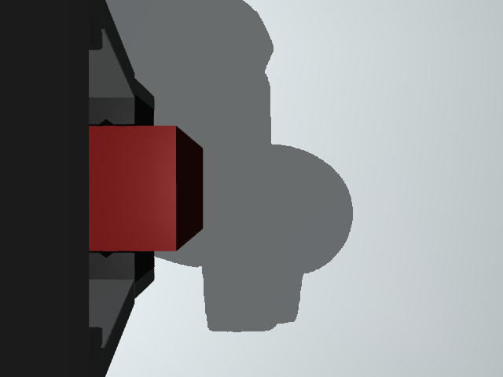

# 逐步规划开发实验 · 2026-09-20

这批实验测试模型能否根据当前图像与实际反馈选择短步动作。所有模型回合使用 `transfer`、seed 7、双相机原始 RGB、逐步 XYZ 控制，候选顺序每轮打乱；不给模型物体或目标坐标，也不使用预设任务阶段。模型接口配置为 `gpt-6-astra`，成功响应报告 `gpt-6-astra-2026-09-03`。

这是带提示修订、API 错误的开发记录，不合并计算成功率。旧版预设技能的 GPT 9/9 与 RGB-D 检测成绩保持独立。完整配置、各回合源文件哈希、输入、轨迹和相机 ZIP 见[机器可读报告](results/planning-2026-09-20.json)。

## 原始结果

| 回合 | 提示 / 条件 | 实际动作 / API 调用 | 结果 |
| --- | --- | --- | --- |
| 初始双相机 | v1，无扰动 | 32 / 32 | `stalled`；放入盘后仅撤离至 TCP z≈0.118 m，未达到评测要求 0.17 m |
| 修订后首次 | v2，无扰动 | 2 / 3 | 第 3 次 API 调用 `ReadTimeout` |
| 修订后首次扰动设置 | v2，计划第 20 步移动目标 | 0 / 1 | 首次 API 调用超时，扰动尚未发生 |
| 当前相机配置版本 | v2，无扰动 | 32 / 32 | `completed`，物理判定成功，235.41 s |
| 工作台目标移动 | v2，第 20 步后将托盘沿 X 平移 6 cm | 43 / 43 | `completed`，物理判定成功，342.21 s |
| 显式规则对照 | v2，仿真状态输入，第 20 步移动目标 | 40 / 0 | `completed`；没有视觉模型参与 |

v1 未向模型说明评测器要求的最终撤离高度。v2 增加目标条件：物体在目的地稳定至少 0.4 s、松爪且不再持物、最终 TCP z≥0.17 m。它没有增加阶段、航点或动作顺序。v1 失败保留；不能把目标条件修订前后的回合视为相同实验设置。

无扰动的 v2 成功回合收到 32 次真实模型回复，累计输入 140,800、输出 4,320 tokens；记录帧未见禁止接触。最终 z≈0.198 m，达到撤离条件。执行由模型逐步选择，程序只执行选择的短步并检查安全性。

## 中途变化后如何调整

工作台回合在第 20 步后将托盘实际支撑面、围边与评测目标一起沿世界 X 平移 0.06 m。扰动只记入评测日志，模型收到的是之后的新画面；没有把目标新坐标或“应移动 X”的指令放入模型输入。

本回合同时出现一次非计划的持物接触丢失：第 19 步后双指接触消失。模型在第 20 步张爪，第 21–24 步微调并下降，第 25 步重新闭爪，双指接触恢复。随后继续搬运，并用正 X 短步对齐已经移动的托盘。第 43 步完成撤离，最终 TCP z≈0.193 m，物理评测通过。累计输入/输出为 189,594 / 6,037 tokens，记录帧未见禁止接触。

重新抓取来自模型选择的动作，没有调用预设抓取恢复技能。这是一条可以核对的“反馈变化—新动作—实际恢复”轨迹；托盘移动和接触丢失在同一回合出现，因此不能将额外动作数完全归因于其中一个变化，也不能从一局推算恢复率。

## 两台相机实际看到了什么

下面两行取自同一成功回合的原始 PNG；`capture_id=1` 是初始状态，`capture_id=15` 是第 14 个动作后的搬运状态。图像未经生成或重绘。

| 时刻 | 外部相机 | 腕部相机 |
| --- | --- | --- |
| 初始 |  |  |
| 搬运中 |  |  |

外部机位固定，但物体与机械臂在画面中移动；腕部机位随手移动，能看见近处方块，也会被手指、手掌遮挡。当前是决策与动作边界上的同步采样。模型等待时图像保持本轮状态，不是连续视频流。

对每个记录的模型输入，已核对 `view`、`capture_id`、PNG 字节长度和 SHA-256 能匹配相机 ZIP，并检查直接视觉输入没有物体/目标坐标。另用真实渲染验证四种相机配置：未启用的视角不采集；所有启用视角在运动后像素变化；腕部标定变化而外部标定固定。它们证明数据链路正确，不等于模型必然利用了全部视觉信息。

## 复现与边界

```bash
# 使用在界面保存的 Chat 连接；会产生真实 API 调用
python scripts/planning_trial.py --saved-connection --cameras both \
  --shuffle-candidates --max-cycles 80 --output runs/vision-transfer

# 加入同一个目标扰动，使用新的输出目录
python scripts/planning_trial.py --saved-connection --cameras both \
  --shuffle-candidates --max-cycles 80 \
  --intervention '{"kind":"target_shift","after_cycle":20,"delta_xy":[0.06,0]}' \
  --output runs/vision-target-shift
```

脚本保存源文件哈希与全部失败，不覆盖旧目录。脚本 headless 速度为 0，工作台实验速度为 4；后者包含动画节奏，不能直接比较整局耗时。机器人本体反馈、安全过滤与最终评分仍由仿真器提供。

这批模型运行仅涉及同一搬运任务和 seed 7，尚未完成单外部、单腕部、移除图像的成对模型实验，也没有未知物体、跨任务或真实机器人的评测。不能据此宣称通用视觉规划、稳定恢复率或优于规则基线/VLA。
