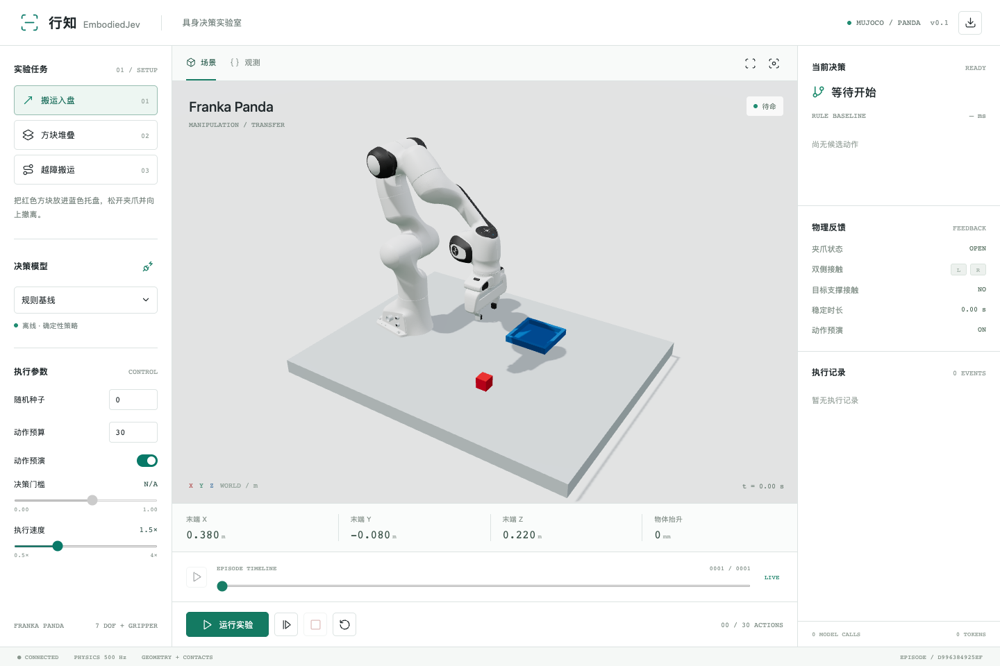
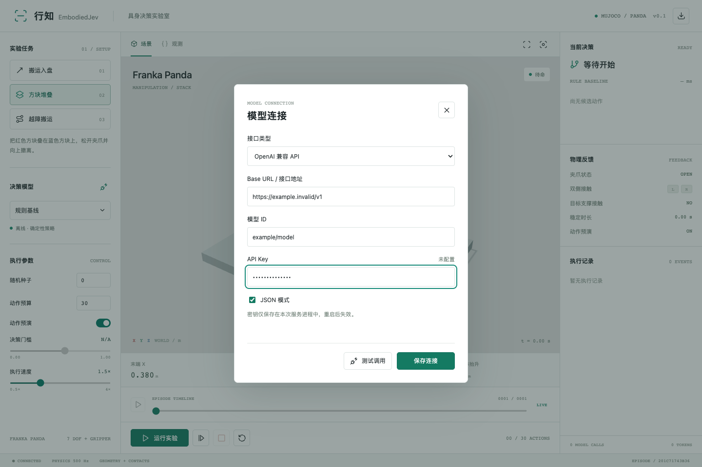

# EmbodiedJev · 行知

**行而有据，知而能行。** A local embodied decision workbench with real MuJoCo physics, a Franka Panda, and a Three.js interface.



行知把结构化决策、候选动作预演、真实接触反馈和实验回放放在同一个工作台中。支持搬运入盘、方块堆叠、越障搬运三个任务。界面可切换规则基线、TypeSafe Jev、MiniCPM5-2B、OpenAI 兼容聊天 API 和结构化决策服务。

本项目是独立实验项目，与 TypeSafe、OpenBMB 和 SemIf 没有隶属关系。Jev 是 TypeSafe 的模型名称；MiniCPM 模式借鉴有限候选概率读出的方式，并不是 Jev 权重或其等价复现。

## Quick Start

Requirements: Python 3.11+, Node.js 22.12+ (or 20.19+). The offline baseline needs no GPU, API key or model download. Dependency installation requires Internet access; the built baseline UI has no external font or CDN requests.

```bash
python -m venv .venv
source .venv/bin/activate
# Windows PowerShell: .venv\Scripts\Activate.ps1
python -m pip install -e '.[test]'
npm ci
npm run build
embodied-jev serve --port 8090
```

Open **http://127.0.0.1:8090**. Choose a task, then run, pause, single-step, stop or reset. Drag the scene to orbit. The timeline scrubs recorded physics poses; the download button exports observations, decisions and trajectories as JSON. The server is a single shared local experiment, so browser tabs control the same episode.

## Models

Click the plug icon beside **决策模型** to open **模型连接**. Choose an interface, enter its URL, model ID and API key, then save. Credentials stay in the current server process; they are not returned to the browser, saved to disk, exported or committed. Saving does not call a model. **测试调用** sends one small real model request and may incur provider charges. **运行实验** starts repeated decisions. Restarting clears connections entered through the form.



Environment variables are also supported. `.env.example` documents them; `.env` is not loaded automatically. Configure variables before starting the server. Unconfigured providers are disabled in the UI. Provider errors stop the episode; there is no automatic fallback.

### Your OpenAI-Compatible API

Choose **OpenAI 兼容 API**. Supply the platform's Base URL (usually ending in `/v1`), its exact model ID and your key. The adapter appends `/chat/completions`. It sends observations and candidate actions in `messages`, asks for `{"choice":"candidate_id"}`, parses JSON and rejects unknown actions. JSON mode can be disabled for providers that do not accept `response_format`; a valid JSON answer is still required.

This path can use models served by OpenRouter, other compatible gateways, or a local vLLM/Ollama service, subject to each endpoint's actual protocol/model support. No live validation against those services is claimed. A key for one platform is not interchangeable with another platform's key.

Chat models generate their choices; this adapter deliberately discards any self-reported probabilities and disables probability gating. They are not native Jev or the local MiniCPM candidate-logit adapter. To configure via environment instead:

```bash
export EMBODIED_API_BASE=https://your-provider.example/v1
export EMBODIED_API_MODEL=your-model-id
read -s EMBODIED_API_KEY
export EMBODIED_API_KEY
embodied-jev serve --port 8090
```

### MiniCPM5-2B

```bash
python -m pip install -e '.[minicpm]'
export EMBODIED_MINICPM=1
export EMBODIED_DEVICE=auto
embodied-jev warmup
embodied-jev serve --port 8090
```

Then select **MiniCPM5-2B**. The first real decision downloads `openbmb/MiniCPM5-2B`, pinned to revision `12a3808a956f869c767195e9266b59c4d21d92e2`. Budget approximately 5 GB of disk for weights and additional RAM/VRAM for execution; CPU uses float32, CUDA/MPS float16. `auto` selects CUDA, then Apple MPS, then CPU. Loaded weights are reused across resets. The UI remains available while the model loads.

`warmup` checks loading and performs a real two-candidate forward pass, reporting the model revision, device and latency. Its process then exits; the web server loads its own copy from the downloaded cache. On Apple Silicon, use `EMBODIED_DEVICE=mps` to require the Apple GPU instead of allowing a CPU fallback. Once the complete model is cached, `HF_HUB_OFFLINE=1` runs without model-download requests. The workbench shows loading, ready and error states next to the model selector.

To record model-driven episodes, including uncertainty pauses and failures:

```bash
EMBODIED_MINICPM=1 EMBODIED_DEVICE=mps embodied-jev benchmark \
  --provider minicpm --seeds 0 1 2 --threshold 0.55 \
  --timeout 600 --output runs/benchmark-minicpm.json
```

The command writes an aggregate report and one full episode JSON per task/seed. Reports include actual model calls, candidate probabilities, revision, device, latency and physical success. A low-probability decision ends a headless episode as `uncertain`; it does not wait indefinitely or change to the baseline. `--threshold 0` disables this gate for exploratory evaluation; candidate probabilities are not calibrated success estimates.

The adapter uses the model's non-thinking chat template, reads next-token logits for candidate letters, then applies softmax only over those candidates. It validates the complete prompt/token boundary and limits context to 4096 tokens. It does not generate JSON, train weights, use a shared-prefix token truncation trick, or silently substitute another model.

These probabilities are conditional on the offered candidates. The UI threshold compares the selected candidate's probability, **not physical success probability or the provider's separate confidence statistic**. This prototype has not established MiniCPM manipulation quality; see [validation](VALIDATION.md).

### Claude Native Messages API

Choose **Claude 原生 API** in the connection form. The default base is `https://api.anthropic.com/v1`; `/messages` is appended unless already present. The model defaults to `claude-fable-5-1`, but must be available to your account or gateway. Alternatively:

```bash
export EMBODIED_CLAUDE_BASE=https://api.anthropic.com/v1
export EMBODIED_CLAUDE_MODEL=claude-fable-5-1
read -s ANTHROPIC_API_KEY
export ANTHROPIC_API_KEY
embodied-jev serve --port 8090
```

Requests use `x-api-key`, `anthropic-version: 2023-06-01`, `max_tokens: 1024`, one user message with state and candidates, and a forced `select_action` tool with an enum of offered choices. No arbitrary tool code is executed: the returned choice selects an existing simulator candidate. The adapter requires exactly one complete matching tool call and validates its choice. Truncation, refusal, unknown options, malformed or multiple calls stop the episode. Input/output tokens, resolved model and latency are recorded; self-reported probabilities are not used. Credentials remain in memory and are never exported. No live Claude result is claimed without an actual configured call.

See [Anthropic Messages API](https://platform.claude.com/docs/en/api/messages) and [model overview](https://platform.claude.com/docs/en/models/overview). Anthropic also offers an [OpenAI SDK compatibility layer](https://platform.claude.com/docs/en/cli-sdks-libraries/libraries/openai-sdk), but it has documented limitations, including ignored `response_format`; protocol compatibility does not make all parameters equivalent.

### TypeSafe Jev

```bash
read -s TYPESAFE_API_KEY
export TYPESAFE_API_KEY
export TYPESAFE_MODEL=jev-1.13.0
embodied-jev serve --port 8090
```

Select **TypeSafe Jev**. Calls use `https://api.typesafe.ai/v1/systemone` and may incur provider charges. See the [official API](https://docs.typesafe.ai/api). No key is sent to the browser, saved in episode logs or included in this repository.

### Existing Local Decision Endpoint

```bash
export EMBODIED_LOCAL_URL=http://127.0.0.1:8078/v1/systemone
export EMBODIED_LOCAL_MODEL=minicpm-jev
# Optional: EMBODIED_LOCAL_KEY
embodied-jev serve --port 8090
```

The service must accept `{model, state, questions: {action: {type: "choice", instructions, criteria}}}` and return `{model, answers: {action: {choice, probabilities}}, usage}`. Every offered action must appear exactly once in `probabilities`, values must be finite and normalized, and `choice` must be an argmax. Contract tests use a mocked HTTP service, not a claim of live provider validation.

For OpenRouter's Jev route, choose **Jev / 结构化决策 API** in the connection dialog, use the full URL `https://openrouter.ai/api/alpha/decisions`, model `typesafe/jev-1.13` and an OpenRouter key with access to that experimental endpoint. Ordinary `/chat/completions` compatibility alone does not imply access to this decisions route. This configuration follows the [public robot-control adapter](https://github.com/openroboto-ai/jev-robot-control/blob/main/incremental_policy.py); endpoint/model access can change.

## What Runs

1. MuJoCo reports privileged TCP/object geometry and contact state.
2. Geometric preconditions build a finite phase menu. A singleton menu skips inference and is recorded as a deterministic gate.
3. Code proposes bounded target motions for the chosen phase: direct, gentle, hold.
4. Optional scratch simulation rejects selected collision and grasp-loss conditions without modifying the live world.
5. The provider chooses among admitted candidates. Low selected probability pauses for review; adjust the threshold and continue, or reset.
6. Damped least-squares IK and joint actuators execute at 500 simulated Hz, with UI snapshots at approximately 25 Hz.
7. Measured outcomes feed the next decision and are recorded for replay.

The grasp is actual bilateral finger contact with a dynamic free-joint cube. There is no object attachment, weld or teleport during execution. Success requires destination support contact, XY error below 25 mm, speed below 25 mm/s for at least 0.4 s with the gripper open, and TCP height at least 170 mm. Stack support is fixed to the table. The configured forbidden-contact monitor covers distal links/fingers against the table and barrier; it is not a complete robot collision or safety system.

This is a **state-based, phase-constrained manipulation prototype**, not camera perception, a VLA, unconstrained planning, LIBERO/ManiSkill integration, certified safety, or a real-robot controller. Direct/gentle motions share an endpoint and differ in duration. Task/phase structure is supplied by code and contributes substantially to task success.

## Validation and Development

```bash
pytest -q
embodied-jev benchmark --output runs/benchmark.json
# UI tests start an isolated server on port 8099 (build first):
npx playwright install chromium
npm run test:ui
# Hot reload, with a backend already on 8090:
npm run dev
```

The included [baseline results](benchmark-baseline.json) cover 3 tasks × seeds 0/1/2: 9/9 successes, eight actions each, zero monitored forbidden-contact steps. These are deterministic baseline smoke tests over small position perturbations, **not Jev/MiniCPM accuracy, a broad success-rate estimate, or a comparison against upstream results**.

The UI test covers desktop/mobile layout, nonblank canvas, motion, camera orbit, pause/resume, single step, replay, export and task reset. Tests and source live in `tests/`, `tests-ui/`, `src/embodied_jev/` and `frontend/`. `npm run build` bundles web assets into the Python package. Build the frontend before building a wheel.

## References and License

See [reference mapping](REFERENCES.md) for the specific ideas adopted and their limits. Original project code is MIT. Vendored Panda robot description/meshes retain their Apache-2.0 license and upstream provenance in [third-party notices](../THIRD_PARTY_NOTICES.md). Model weights are not redistributed; their own licenses apply. See [contributing](../CONTRIBUTING.md) for development and publication checks.
