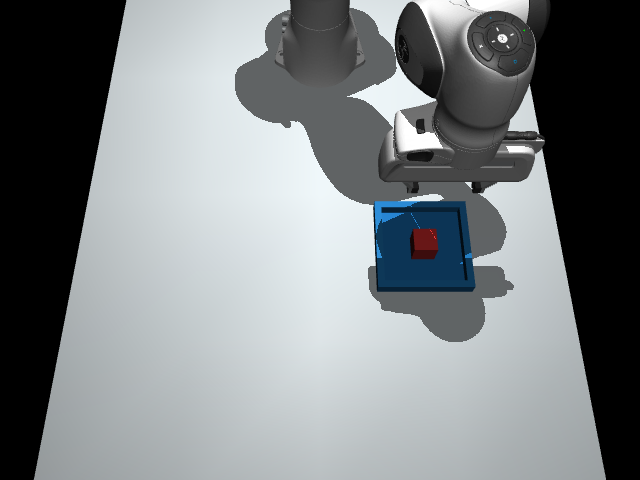
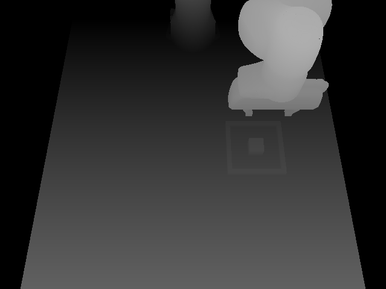

# 👁️ 视觉观察模式

提供两条视觉路线：**RGB-D 估计**在本地检测并估计物体坐标，再交给决策模型；**直接图像**将已启用相机的 RGB 原图交给支持图像的模型，不提供物体或目标坐标。直接图像需要逐步 XYZ 控制，详见[规划说明](PLANNING.md)。仿真状态模式仍保留，方便对照。

```text
仿真 RGB-D 相机 → 本地颜色检测与三维定位 → 阶段 / 动作候选 → 模型选择 → 执行与反馈
```

在“相机配置”选择仅外部、仅腕部、双相机或无相机，在“视觉”页签查看已启用视角的 RGB 与深度图。无相机使用非视觉状态输入；仿真状态模式下也可仅打开相机预览。感知在动作边界采样，同一仿真时刻复用已有观测；这里显示的是最近一次采样，不是独立连续推流。

## 相机怎样提供物体信息

外部相机从工作台侧方斜俯视，腕部相机固定在手部，随末端移动；每路为 640 × 480，具有独立标定。两路启用时采集同一个仿真时刻。只选一种时，不会读取另一种画面。

RGB-D 路线检测已有场景中的红色方块、蓝色目标和黄色障碍物：寻找颜色区域，结合深度和标定估计位置。已知方块边长为 4 cm，以可见表面推算中心和放置高度；这些尺寸与颜色不是模型从图片中学出来的。双相机优先采用外部检测，以腕部检测补充缺失物体。直接图像路线完全跳过此检测器。

| 最近采集的 RGB | 深度预览 |
| --- | --- |
|  |  |

阶段判断、动作目标和传给模型的物体位置使用这份估计。机械臂末端位置、夹爪开合和接触反馈仍来自模拟机器人传感器；它们相当于另一路本体与接触观测。

图像检测在本机完成，不调用云端视觉 API；选择云端决策模型时，发送的仍是结构化状态。内部观察模式分别记为 `privileged`（直接仿真状态）和 `rgbd`（视觉估计）。

## 看不清时怎么办

遮挡期间会标记为跟踪估计，时间自最后一次像素识别算起：

| 目标 | 最长保留时间 | 假设 |
| --- | --- | --- |
| 未夹持的方块 | 4 秒 | 遮挡期间保持静止 |
| 双指接触夹持的方块 | 8 秒 | 夹持不滑移，按末端位移推算位置 |
| 静态蓝色目标、黄色障碍 | 12 秒 | 目标或障碍保持静止 |

这里计算的是**仿真时间**，暂停或等待 API 不消耗这些时限。按末端位移跟踪不会刷新视觉观测的年龄。方块、放置目标或越障任务必需的障碍从未识别、或估计过期时，本轮停止并保留最近画面，不从仿真真值补回坐标。跟踪只是有条件的估计，并不等于重新看到了物体。

松手后的第一帧可沿用夹持时的 8 秒限额一次，下一帧恢复未夹持限额；这不会刷新最后一次像素定位时间。

这个版本是**仿真辅助的视觉决策实验**。启用候选安全预演时，预演可以读取 MuJoCo 真值来筛查风险；视觉决策仅保留安全标记，不读取预演得到的真实物体位置或目标误差。最终任务是否成功，由独立的物理评估判定；视觉观察中的成功状态只是估计。因此不能把结果当成仅依靠相机的完整机器人能力。

## 接入视觉后还能快速决策吗

可以保留有限候选决策方式，但总耗时还要加上拍摄、检测和定位。视觉模块负责“现在在哪里”，决策模型负责“接下来选什么”，控制器负责执行。接口分开后，可以独立优化感知频率、跟踪和模型调用。

这里没有给 MiniCPM5-2B 增加原生多模态能力，也没有加载通用视觉语言模型或 VLA 权重。已有 GPT-6 的 9/9 结果使用直接仿真状态，不能沿用为视觉模式成绩；视觉定位误差、感知耗时和任务成功率需要重新测量。

## 模型现在能决定多少

当前程序先按观测筛出靠近、抓取、抬升、搬运等可选阶段，再提供直接执行、减速执行或保持不动等候选。直接与减速通常共享同一个目标位置；阶段只有一个选项时跳过该次推理。因此，位置会随视觉观测变化，但操作流程和技能主要由代码安排。

Jev 的有限选项接口不要求预先写好完整路径。后续可以改为逐轮选择小幅 XYZ 位移和夹爪命令，或从当前观测生成多种抓取、绕行方案，让模型决定动作组合与顺序。这些模式尚未实现；目前的成功率只说明现有感知、候选选择和执行流程能配合运行，不能据此证明自主规划能力。

开源实现的预设程度也不同：[OpenRoboto](https://github.com/openroboto-ai/jev-robot-control/tree/7a4ed8b72c3c17d7aa790678ed9660df67c10dd3)让模型选择意图、XYZ 正负方向和夹爪命令，每次只执行一个短步；步长、固定姿态 IK 和工作区仍由代码规定。[openarm-jev-lab](https://github.com/tripathiarpan20/openarm-jev-lab/tree/c89a73f6ff10094acc3d27e45ef91a31791eadb2)根据几何关系生成靠近、抓取、放置等候选，模型每个短动作后重新选择，也保留了离散方向菜单。因此，定义动作空间不等于写死完成任务的顺序。

若要检验更自主的控制，应移除当前按任务阶段计算的目标点，让模型在每轮观测后选择位移和夹爪动作，同时保留 IK、工作区限制和接触停止。评测需要加入新起点、目标位置变化和中途扰动，统一感知与动作接口，对照规则策略，并记录失败、调用次数和总耗时。候选顺序也应变化，以检查模型是否只是偏好某个菜单位置。

## 本次验证

2026-09-20，修正相机视角后，用**规则基线＋RGB-D 估计**运行搬运、堆叠、越障三个任务，各 seed 0，均以 `completed` 结束、通过物理判定，每局 8 个动作、9 次感知采集。**这一批模型调用为 0。** 上方相机图片来自这批规则验证。

排除每局首次相机初始化后的 24 次采集中，感知处理平均 **25.28 ms**，范围 **22.03–34.90 ms**，包括渲染、检测和 PNG 准备。该数字不包含模型推理，也不是完整机器人反应时间。运行采用不等待动画的 headless 模式，不能与网页 GPT 实验的整局耗时直接比较。

调试时，正俯视相机的三次运行都因手掌遮挡而在最后停止；另一视角下，搬运失败、堆叠初始化检测失败。这些记录也保留在[视觉验证报告](results/rgbd-2026-09-20.json)中，不能算成功。最终相机经过这些场景调试，因此 3/3 只说明当前三个开发场景能跑通。

随后，本地工作台另有一局 **RGB-D＋GPT-6** 搬运记录完成，task=`transfer`、seed=0，8 个动作、13 次真实 API 调用，平均调用 2.58 秒、整局 42.88 秒。输入 10,028 tokens，输出 171；API 返回模型名 `gpt-6-astra-2026-09-03`。逐项核对后，模型输入、阶段和动作目标均来自视觉估计，未发现规则回退。9 次采集中，方块在 3 帧直接识别、6 帧依靠遮挡跟踪；最后重新识别成功。

这是一局从工作台导出的独立记录，保存在[视觉＋GPT 报告](results/rgbd-gpt6-2026-09-20.json)，不与上面的规则批次或旧 GPT 9/9 合并。它说明感知结果能交给 GPT 选择预设动作，尚未证明自主轨迹规划或相对规则基线的优势。RGB-D＋MiniCPM 尚未实测。

复现规则视觉测试（需要可用的 OpenGL 渲染环境）：

```bash
embodied-jev benchmark --provider baseline --observation-mode rgbd \
  --tasks transfer stack barrier --seeds 0 --max-cycles 16 --timeout 90 \
  --output runs/rgbd-baseline.json
```

## 怎样继续扩展

后续视觉后端可以用目标检测、分割或姿态估计替换颜色检测，只要输出同一份物体位置、状态和观测来源即可。真实相机还需要内外参标定、深度误差处理及遮挡验证；新增不同颜色、形状的物体，也需要同步扩展检测器和尺寸先验。

[jev-drone 的感知实现](https://github.com/RomanSlack/jev-drone/blob/main/flight.py)提供了将感知与决策分开的参考做法。它使用深度和 MuJoCo 的分割几何 ID 获取目标信息；分割 ID 来自仿真器，并不是学习得到的物体识别。行知当前使用本地颜色检测，同样应把已知条件写清楚。

上述历史 RGB-D 成绩属于单外部相机版本。增加腕部补充后，另行重跑双相机 RGB-D＋规则基线：三个任务各 seed 0 均以 8 步完成，零模型调用、零禁止接触步；结果单独保存在[新报告的回归部分](results/planning-2026-09-20.json)。直接图像的开发记录见[规划实测](PLANNING_RESULTS.md)。JSON 保存输入图像哈希，“下载观测图”另存带 PNG 和清单的 ZIP，可验证画面随动作与视角变化。

相关说明：[快速推理](FAST_INFERENCE.md) · [扩展开发](EXTENDING.md) · [参考项目](REFERENCES.md)
